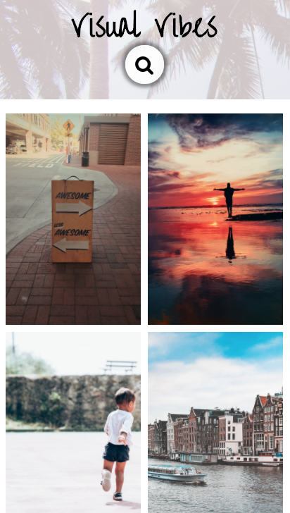

# Unsplash image search

This is a simple application which utilizes the unsplash API in order to search for any keywords by matching query terms.

## Motivations

I built this project in order to show how vanilla JS can be used to work with the Unsplash API and to illustrate how this can be done. It was important for me for this UI to be mobile friendly. I accmplished this by adjusting the grid layout using media queries.

## technologies

- HTML5
- CSS3
- JAVASCRIPT
